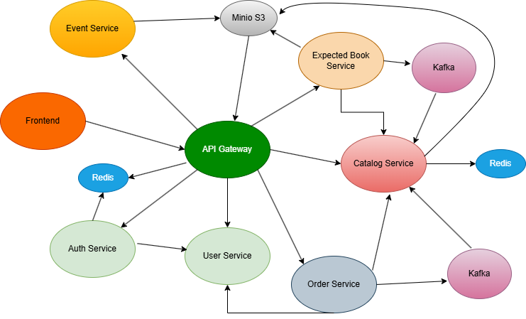

# 📚 Library Microservices System

The project is a scalable microservices platform for managing an online library, built on Spring Cloud.
---

## 🏗️ System architecture

The system consists of several isolated microservices that communicate with each other via REST API (synchronously) and Apache Kafka (asynchronously).



### Main components:
*   **API Gateway (`api-gateway`)** — a single entry point that handles request routing and JWT token validation.
*   **Service Catalog (`catalog-service`)** — book collection management, integrated with **MinIO** for cover storage and **Redis** for caching.
*   **Auth Service (`auth-service`)** — user authentication, issuing JWT tokens, registration and password reset via Email.
*   **User Service(`user-service`) - user management.
*   **Order Service (`order-service`)** — processing orders and book reservations, interacting with other services via Kafka events.
*   **Expected Books (`expected-books-service`)** — service of expected new products with integration of email notifications.
*   **Event Service (`event-service`)** - library news and events management service, integrated with **MinIO** for cover storage.
*   Frontend Service(`frontend-microservice`) - is responsible for the system's user interface and user interaction. It is implemented as an isolated container that is completely abstracted from the internal logic of microservices and communicates exclusively with the **API Gateway**.   
---

## 🛠️ Technology stack

*   **Backend:** Java 17, Spring Boot 3.x, Spring Cloud Gateway, Spring Data JPA, Spring Web
*   **Data & Caching:** PostgreSQL 15, Redis
*   **Object Storage:** MinIO (S3-compatible)
*   **Messaging:** Apache Kafka (Event-Driven communication)
*   **DevOps:** Docker, Docker Compose
*   **Tools:** Hibernate Validator, Lombok, Model Mapper

---

## 🚀 Local launch (Quick Start)

To run the project locally, you will need **Docker** and **Docker Compose** installed.

### 1. Cloning a repository
```bash
git clone https://github.com/D1fferr/LibraryProject.git 
cd LibraryProject
```

### 2. Setting environment variables
Create a .env file in the root folder of the project (next to docker-compose.prod.yml) and fill it with the following example (You can leave the mail fields blank, but then the forwarding of messages to mail will not work.):
````
JWT_SECRET=yourjwtsecret
DB_PASSWORD=yourdbpassword
DB_USERNAME=yourdbusername
DB_URL=jdbc:postgresql://db:5432/library_db
MAIL_LOGIN=yourmaillogin
MAIL_PASSWORD=yourmailpassword
MAIL_FROM=library
MAIL_HOST=yourmailhost
MINIO_ROOT_USER=yourminiouser
MINIO_ROOT_PASSWORD=yourminiopassword
MINIO_ENDPOINT=http://minio:9000
MINIO_BUCKET=images
REDIS_HOST=redis
REDIS_PORT=6379
KAFKA_ENDPOINT=kafka:9092
GATEWAY_URL=http://api-gateway:8080
CATALOG_URL=http://catalog-service:8081
EXPECTED_BOOK_URL=http://expected-books-service:8082
EVENT_URL=http://event-service:8083
RESERVATION_URL=http://order-service:8084
USER_URL=http://user-service:8087
AUTH_URL=http://auth-service:8086
FRONTEND_URL=http://frontend-service:8089
````
### 3. Launching infrastructure and services
```bash
docker compose -f docker-compose.prod.yml --env-file .env up
```
> 📌 **Database Access Note:**
> Inside the Docker network, PostgreSQL runs on the standard port `5432`. However, to avoid conflicts with your local PostgreSQL instances, it is mapped to port `5433` on your host machine. You can connect to it using URL: `localhost:5433`.

Docker will automatically download the necessary database images, message broker, mount the initialization scripts for PostgreSQL (init.sql), and create the necessary topics in Kafka and buckets in MinIO.
* All requests to the system go exclusively through the API Gateway (port 8080).
* So, you can type http://localhost:8080 in your browser. A frontend with all the functionality will open in front of you.
* You can also register as an admin by clicking the appropriate button during registration, and the admin panel will become available to you, where you can fully manage the library.
---

## ⚙️ Implementation features (Features)
* Database Initialization: When first started, the db container automatically loads the initial table structure and test data (seed data) from the ./postgres-init folder.
* Storage Warmup: Thanks to the minio-mc utility, a public images bucket is automatically created during startup and default book photos are loaded.
* Kafka Automining: The script automatically creates expected-book-topic and reservations topics with 3 partitions for asynchronous data exchange between services.
---

## 🗺️ Future Roadmap
* **Kubernetes Migration:** Moving deployment manifests to K8s for auto-scaling and better resource management.
* **Observability:** Integrating Prometheus and Grafana to monitor microservices metrics and request latencies.
* **Distributed Tracing:** Adding Spring Cloud Sleuth / Micrometer and Zipkin to trace async requests through Kafka.
